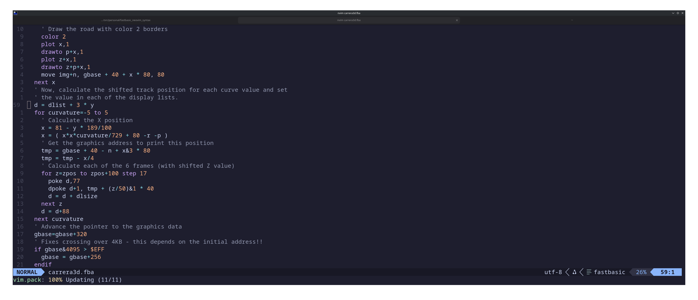

# FastBASIC Neovim/Vim Syntax Highlighting Plugin
FastBASIC syntax for Neovim

This is a simple syntax highlighting plugin for Neovim and the Atari 8 bit
FastBASIC programming language!

## Installation
Just copy the contents of this folder
into the root of your Neovim configuration.

UNIX/Mac:

Assuming you have Neovim's config in $HOME/.config/neovim

```bash
cp -r * $HOME/.config/neovim
```

Restart neovim.

After that Neovim will properly syntax highlight 
FastBASIC programs with .fba extensions
